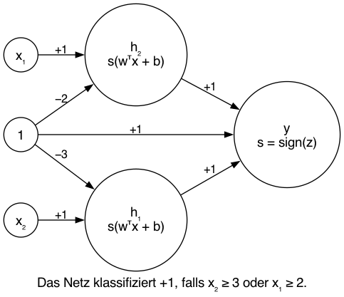

# Aufgabe 01

Das dargestellte Multilayer-Perzeptron besteht aus zwei Hidden-Perzeptrons und einem Output-Perzeptron mit sign-Aktivierung.  
Die Hidden-Perzeptrons realisieren die linearen Schwellen x1 ≥ 2 bzw. x2 ≥ 3, der Output verknüpft beide Ausgaben über eine ODER-Operation.  
Damit klassifiziert das Netz genau die geforderten Bereiche im Eingaberaum mit +1.

---

# Aufgabe 02

## MLP (25–64–32–4), ReLU

**Gegeben:**
- Eingabeschicht: 25 Neuronen
- Hidden Layer 1: 64 Neuronen
- Hidden Layer 2: 32 Neuronen
- Ausgabeschicht: 4 Neuronen  
(Bias-Zellen nicht mitgezählt)

Aktivierungsfunktion in allen Schichten:  
ReLU(u) = max(0, u) (elementweise)

---

## Dimensionen der Gewichtsmatrizen und Bias-Vektoren

Allgemeine Vorwärtsgleichung:

z[l] = W[l] · a[l−1] + b[l]

Dabei gelten folgende Dimensionen:
- W[l]: Anzahl Neuronen in Schicht l × Anzahl Neuronen in Schicht l−1
- b[l]: Anzahl Neuronen in Schicht l × 1

Konkret ergibt sich:
- W[1]: 64 × 25,  b[1]: 64 × 1
- W[2]: 32 × 64,  b[2]: 32 × 1
- W[3]: 4 × 32,   b[3]: 4 × 1

---

## Vorwärtslauf

a[0] = x  (25 × 1)

z[1] = W[1] · a[0] + b[1]  
a[1] = ReLU(z[1])

z[2] = W[2] · a[1] + b[2]  
a[2] = ReLU(z[2])

z[3] = W[3] · a[2] + b[3]  
a[3] = ReLU(z[3])

Ausgabe des Netzes:
ausgabe = a[3]  (4 × 1)

Die Ausgabe besteht aus vier nichtnegativen Werten (wegen ReLU-Aktivierung).  
Diese können als Scores für eine Vier-Klassen-Klassifikation interpretiert werden oder als Regressionsausgabe mit vier nichtnegativen Zielgrößen.

## Aufgabe 3

## (1) Logistische Regression

**Wie verhält sich die Entscheidungsgrenze?**
Die logistische Regression lernt bei lineare Entscheidungsgrenzen. Beim Gaussian-Datensatz ist die genug, bei allen anderen Datensätzen kann die Struktur nicht korrekt erfasst werden.

**Was können Sie über Trainings- und Testkosten sagen? Entsteht eine Überanpassung?**  
- Gaussian: sehr niedrige Trainings- und Testkosten, keine Überanpassung.  
- Circle, Spiral, XOR: hohe und ähnliche Trainings- und Testkosten --> Underfitting.

**Wie schnell wird die Entscheidungsgrenze berechnet?**  
schnell (da geringer Datensatz)
 

---

## (2)MLP mit Noise = 0

### Datensatz: Circle

#### 1 Hidden Layer (2, 3, 5 Neuronen) (zusammengefasst)

**Wie verhält sich die Entscheidungsgrenze?**
Mit steigender Neuronenzahl wird die Entscheidungsgrenze zunehmend nichtlinear.  
Ab 3–5 Neuronen kann die Kreisstruktur gut abgebildet werden.

**Was können Sie über Trainings- und Testkosten sagen? Entsteht eine Überanpassung?**  
Trainings- und Testkosten sind niedrig und ähnlich --> gute Generalisierung.

**Wie schnell wird die Entscheidungsgrenze berechnet?**
ReLU lernt am schnellsten, tanh etwas langsamer, Sigmoid am langsamsten.

**Können alle Datenpunkte jedes mal korrekt klassifiziert werden? Warum?**
Mit ausreichender Neuronenzahl nahezu vollständig möglich.

**Versteckte Schichten:**  
Die erste Schicht lernt einfache lineare Trennungen, die letzte kombiniert diese zu einer geschlossenen Kreisstruktur.

---

#### Mehrere Hidden Layer ((5,5), (7,7,7), (7,7,7,7)) (zusammengefasst)

**Wie verhält sich die Entscheidungsgrenze?**
Präzise, klare Grenzen; zusätzliche Tiefe verbessert die Annäherung nur geringfügig.

**Was können Sie über Trainings- und Testkosten sagen? Entsteht eine Überanpassung?**  
Keine deutliche Überanpassung bei Noise = 0.

**Wie schnell wird die Entscheidungsgrenze berechnet?**
Mit zunehmender Tiefe langsameres Training.

**Können alle Datenpunkte jedes mal korrekt klassifiziert werden? Warum?**
Nahezu vollständig möglich.

**Versteckte Schichten:**  
Frühe Schichten lernen lokale Merkmale, spätere Schichten eher kreisartige Stukturen.

---

### Datensatz: Spiral

#### 1 Hidden Layer (2, 3, 5 Neuronen) (zusammengefasst)

**Wie verhält sich die Entscheidungsgrenze?**
Zu grob, Spiralstruktur wird nicht erfasst.

**Was können Sie über Trainings- und Testkosten sagen? Entsteht eine Überanpassung?**  
Hohe und ähnliche Kosten --> Underfitting.

**Wie schnell wird die Entscheidungsgrenze berechnet?**
Schnell, aber nicht sinnvoll.

**Können alle Datenpunkte jedes mal korrekt klassifiziert werden? Warum?**
Nicht möglich.

**Versteckte Schichten:**  
keine komplexen Muster.

---

#### Mehrere Hidden Layer ((5,5), (7,7,7), (7,7,7,7)) (zusammengefasst)

**Wie verhält sich die Entscheidungsgrenze?** 
Mit zunehmender Tiefe werden Spiralabschnitte sichtbar, jedoch nicht perfekt.

**Was können Sie über Trainings- und Testkosten sagen? Entsteht eine Überanpassung?**  
Trainingskosten sinken stark, Testkosten bleiben höher --> Eher Overfitting.

**Wie schnell wird die Entscheidungsgrenze berechnet?**
Deutlich langsamer, besonders bei tanh und Sigmoid.

**Können alle Datenpunkte jedes mal korrekt klassifiziert werden? Warum?**
Nur näherungsweise möglich.

**Versteckte Schichten:**  
Späte Schichten zeigen Aktivierungen für einzelne Spiralabschnitte.

---

## (3) MLP mit Noise = 15

### Datensatz: Circle

**Wie verhält sich die Entscheidungsgrenze?** 
Entscheidungsgrenzen werden unruhiger und lokal gezackter.

**Was können Sie über Trainings- und Testkosten sagen? Entsteht eine Überanpassung?**  
Tiefe Netze zeigen sinkende Trainingskosten, aber höhere Testkosten --> Überanpassung.

**Wie schnell wird die Entscheidungsgrenze berechnet?**
Ähnlich wie bei Noise = 0, jedoch instabilere Lernverläufe.

**Können alle Datenpunkte jedes mal korrekt klassifiziert werden? Warum?**
Nicht vollständig möglich, da sich Klassen überlappen.

**Versteckte Schichten:**  
Letzte Schichten reagieren stark auf einzelne noisy Datenpunkte.

---

### Datensatz: Spiral

**Wie verhält sich die Entscheidungsgrenze?**
Nur tiefe Netze können sich Spiralstrukturen annähern, aber mit variierender Grenze.

**Was können Sie über Trainings- und Testkosten sagen? Entsteht eine Überanpassung?**  
Deutlicher Train/Test-Unterschied bei tiefen Netzen --> starke Überanpassung.

**Wie schnell wird die Entscheidungsgrenze berechnet?**
Langsam und instabil, besonders bei Sigmoid.

**Können alle Datenpunkte jedes mal korrekt klassifiziert werden? Warum?**
Nicht möglich aufgrund von Noise und komplexer Struktur.

**Versteckte Schichten:**  
Frühe Schichten lernen einfache Richtungsmerkmale, späte Schichten stark spezialisierte Muster.

---

Das Arbeitsblatt bzw Markdown habe ich per LLM formatiert und "poliert".

